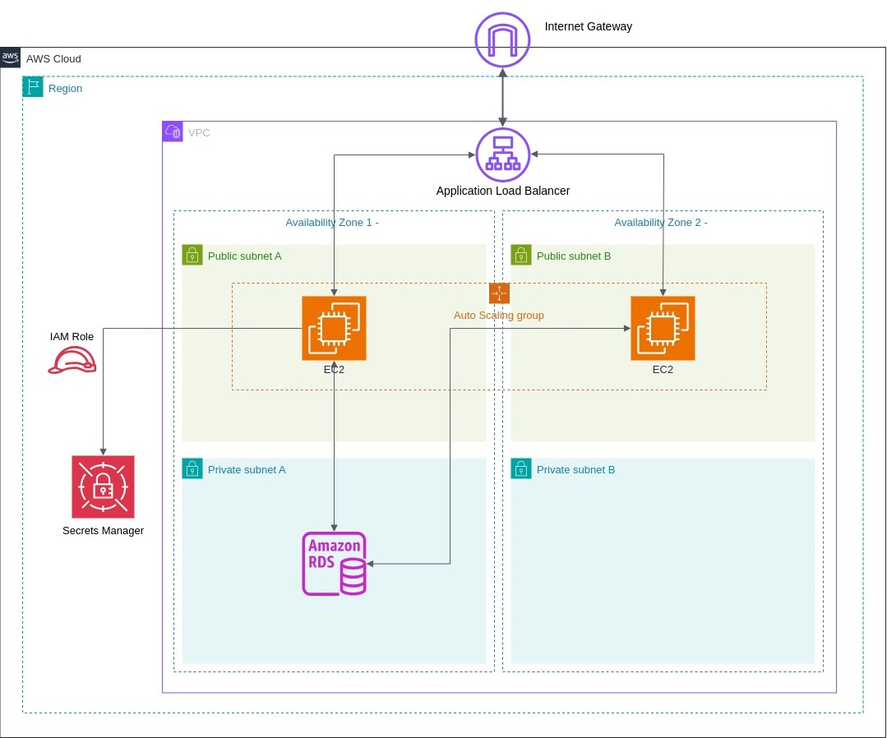

# Scalable Web Application with ALB and Auto Scaling

This project demonstrates how to deploy a secure, scalable, and highly available web application on AWS using core services such as EC2, Application Load Balancer (ALB), Auto Scaling Groups (ASG), IAM, RDS, Secrets Manager, and CloudWatch.

---

## Architecture Overview

A multi-tier web application architecture that uses:
- Public subnets for the Load Balancer and Bastion Host
- Private subnets for EC2 instances and the RDS database
- Auto Scaling and ALB for scalability and fault tolerance
- Secrets Manager to securely store and access database credentials

---

## Key AWS Services Used

| Service               | Purpose                                                                 |
|----------------------|-------------------------------------------------------------------------|
| EC2                  | Hosts the web application                                               |
| ALB (Application Load Balancer) | Distributes traffic to EC2 instances across AZs                     |
| ASG (Auto Scaling Group)        | Scales EC2 instances up/down based on traffic/demand               |
| RDS (MySQL/PostgreSQL)         | (Optional) Stores backend data with Multi-AZ high availability      |
| IAM                  | Provides secure, role-based access to AWS services                      |
| Secrets Manager      | Stores and retrieves database credentials securely                      |
| CloudWatch           | Monitors logs, metrics, and alarms for visibility                       |
| SNS                  | Sends notifications (e.g., when alarms are triggered)                   |

---

## Security Considerations

- EC2 instances reside in **private subnets** for security.
- Access to EC2 for management is done via a **bastion host** in a public subnet.
- **IAM roles** are assigned to EC2 to allow secure access to **Secrets Manager** and **CloudWatch**.
- Security Groups and NACLs restrict unauthorized traffic.

---

## ⚙️ Deployment Steps

### 1. **Launch a VPC (optional)**  
Use an existing VPC or create a custom VPC with:
- 2 public subnets (for ALB & Bastion)
- 2 private subnets (for EC2 & RDS)
- Internet Gateway and NAT Gateway

---

### 2. **Create a Secrets Manager Secret**
- Store the database credentials:
  \`\`\`json
  {
    "username": "admin",
    "password": "your-password"
  }
  \`\`\`
- Name: \`prod/db-credentials\`
- Give your EC2 IAM role access to retrieve this secret.

---

### 3. **Create an IAM Role for EC2**
Attach the following policies:
- \`AmazonSSMManagedInstanceCore\` (for EC2 connect)
- \`SecretsManagerReadWrite\` (or custom with read-only to specific secret)
- \`CloudWatchAgentServerPolicy\` (for monitoring)

---

### 4. **Launch EC2 Instances in ASG**
- AMI: Amazon Linux 2 / Ubuntu
- User Data Script to:
  - Install web server (e.g., Apache/Nginx)
  - Download app code from S3/GitHub
  - Fetch DB credentials from Secrets Manager
  - Configure DB connection

\`\`\`bash
#!/bin/bash
yum update -y
yum install -y httpd jq
systemctl start httpd
systemctl enable httpd

# Get credentials from Secrets Manager
SECRET=$(aws secretsmanager get-secret-value --secret-id prod/db-credentials --region us-east-1)
USERNAME=$(echo $SECRET | jq -r .SecretString | jq -r .username)
PASSWORD=$(echo $SECRET | jq -r .SecretString | jq -r .password)

# Configure app with DB credentials (example)
echo "DB_USER=$USERNAME" >> /var/www/html/.env
echo "DB_PASS=$PASSWORD" >> /var/www/html/.env
\`\`\`

---

### 5. **Set Up Application Load Balancer (ALB)**
- Target group: EC2 ASG instances
- Listener: HTTP (port 80)
- Health checks: \`/health\` or \`/index.html\`
- Attach ALB to public subnets

---

### 6. **Create Auto Scaling Group (ASG)**
- Launch template: Use EC2 config above
- Min/Max/Desired: Example: 2/5/2
- Scaling policy: Based on CPU utilization
- Attach to ALB target group

---

### 7. **(Optional) Setup RDS (MySQL/PostgreSQL)**
- Enable Multi-AZ
- Use private subnets and DB subnet group
- Connect using credentials from Secrets Manager

---

### 8. **Monitoring and Alerts**
- Enable **CloudWatch Logs** for EC2 logs and metrics
- Create **CloudWatch Alarms**:
  - High CPU (>70%) → scale out
  - Low CPU (<30%) → scale in
  - Send notifications via **SNS**

---

## Testing

- Load the ALB DNS endpoint in your browser: \`http://<ALB-DNS-name>\`
- Check scaling by simulating load
- Check Secrets retrieval via logs (\`/var/log/cloud-init.log\`)
- Validate RDS connection using secrets

---

## Cost Optimization Tips

- Use **Spot Instances** in ASG mixed policy (if app allows interruption)
- Enable **Auto Stop** on idle RDS databases (dev only)
- Monitor and remove unused resources

